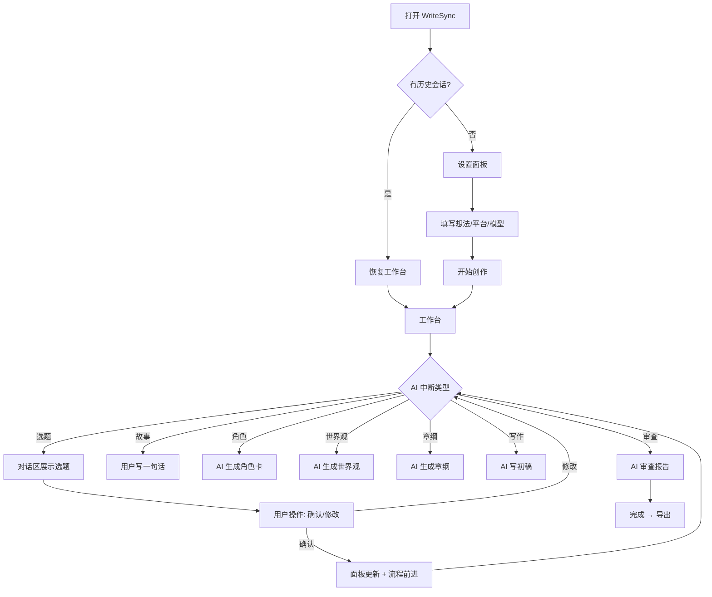
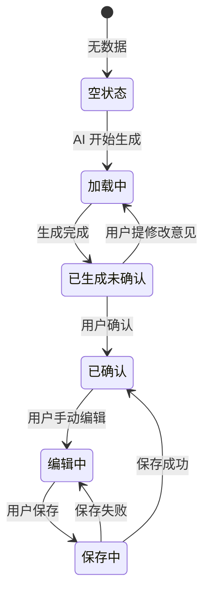
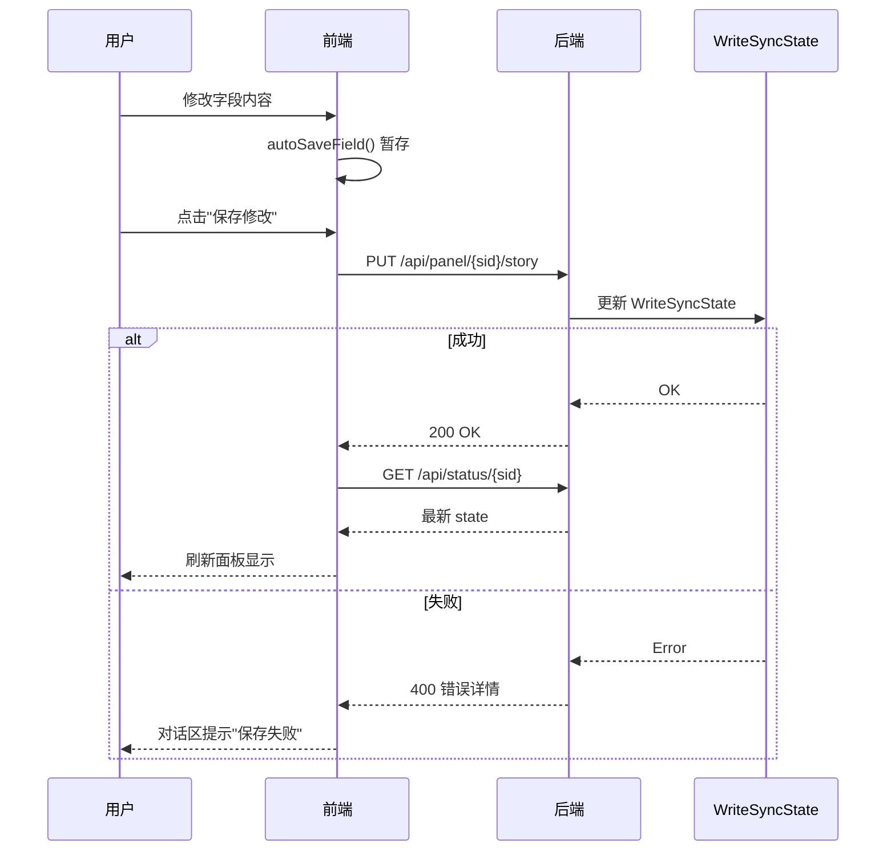

# 产品需求文档：WriteSync Web UI 写作工作台 - V2.0

---

## 1. 综述

### 1.1 项目背景与核心问题

**核心问题**：当前 WriteSync Web UI 是"单页对话式"界面，AI 生成内容后用户只能在聊天区查看，无法在独立的工作面板中查看、编辑和管理创作内容。作者需要一个像 Scrivener 那样结构化的写作工作台。

**目标用户**：网文作者，需要 AI 协助但自己掌控创作方向。

**核心价值**：让用户在专业的工作台中，通过 AI 对话驱动创作流程，同时在独立面板中管理故事大纲、角色、世界观、章纲和正文。

### 1.2 核心用户旅程

```
1. 设置阶段：选择平台/模型 → 输入故事想法 → 启动创作
2. 策划阶段：AI 出选题 → 用户选 → 用户写一句话 → AI 扩五段 → 讨论确认
3. 设定阶段：角色 → 世界观 → 叙事概要 → 章纲
4. 写作阶段：逐章写作（参考栏+编辑器）
5. 审查阶段：全书审查 → 确认完成 → 导出
```

### 1.3 Mermaid 图

#### 1.3.1 用户操作主流程



#### 1.3.2 面板状态机



#### 1.3.3 编辑保存时序



---

## 2. 用户故事详述

### 阶段一：设置与启动

---

#### US-01: 作为作者，我希望在一个设置面板中填写故事想法、选择平台和模型，以便快速启动创作流程。

*   **价值陈述**:
    *   **作为** 网文作者
    *   **我希望** 在统一的设置面板中完成故事想法、目标平台、LLM 模型和流程模式的选择
    *   **以便于** 一次性配置好创作环境并快速进入工作台

*   **业务规则与逻辑**:
    1.  **前置条件**: 无
    2.  **操作流程 (Happy Path)**:
        1. 用户打开页面，看到设置面板（居中弹窗）。
        2. 输入故事想法（textarea，非必填）。
        3. 选择目标平台（下拉框：起点/番茄/飞卢/纵横）。
        4. 选择 LLM 模型（下拉框：qwen3.6-plus/deepseek-v4-flash）。
        5. 选择流程模式（下拉框：全流程/仅策划）。
        6. 点击"开始创作"，面板消失，工作台显示，AI 开始运行。
    3.  **异常处理**:
        * 点击按钮后禁用按钮，显示"启动中..."，防止重复提交。
        * 网络失败时显示"网络错误"提示，设置面板重新显示。
        * LLM 认证失败时显示错误信息，自动回到设置面板。

*   **验收标准**:
    *   **场景1: 正常启动**
        *   **GIVEN** 用户已填写所有配置
        *   **WHEN** 点击"开始创作"
        *   **THEN** 设置面板消失，工作台显示，对话区出现第一条 AI 消息
    *   **场景2: 网络错误**
        *   **GIVEN** 用户已填写配置但网络断开
        *   **WHEN** 点击"开始创作"
        *   **THEN** 显示"网络错误"提示，设置面板重新可见，按钮恢复

*   **页面布局线框图 (ASCII Wireframe)**:
    ```text
    +------------------------------------------------+
    |               ✍️ 开始创作                        |
    |       你的故事 — AI 幕僚团队与你一起打磨          |
    |                                                |
    |  故事想法                                       |
    |  +------------------------------------------+  |
    |  | 例如：程序员穿越修仙世界...                |  |
    |  +------------------------------------------+  |
    |                                                |
    |  目标平台                                       |
    |  +------------------------------------------+  |
    |  | 起点中文网                          [ v ] |  |
    |  +------------------------------------------+  |
    |                                                |
    |  LLM 模型                                      |
    |  +------------------------------------------+  |
    |  | qwen3.6-plus 默认·快速               [ v ]|  |
    |  +------------------------------------------+  |
    |                                                |
    |  流程                                          |
    |  +------------------------------------------+  |
    |  | 全流程（策划+写作）                   [ v ]|  |
    |  +------------------------------------------+  |
    |                                                |
    |  [            开始创作 →              ]        |
    +------------------------------------------------+
    ```

---

### 阶段二：故事策划

---

#### US-02: 作为作者，我希望 AI 帮我出选题建议，我选择一个后自己写一句话核心，AI 再将它展开为五句话，以便我能快速形成故事框架。

*   **价值陈述**:
    *   **作为** 网文作者
    *   **我希望** AI 出选题 → 我选择 → **我写一句话** → AI 扩五句 → 我讨论修改
    *   **以便于** 以我的创意为核心，AI 辅助扩展，形成完整的故事框架

*   **业务规则与逻辑**:
    1.  **前置条件**: 会话已创建
    2.  **操作流程 (Happy Path)**:
        1. AI 在对话区展示 3-5 个选题卡片（标题/题材/卖点）。
        2. 用户在对话区点击操作按钮"确认"完成选题。
        3. 用户在对话区输入自己的一句话故事核心。
        4. 用户确认后，AI 将一句话展开为五句话摘要。
        5. 对话区展示五句话，用户讨论修改或确认。
        6. 确认后，故事大纲面板同步更新。
    3.  **异常处理**:
        * 如果用户不满意五句话，在对话区输入修改意见，AI 根据意见重新生成。
        * 用户可随时在故事面板手动编辑任何字段，点击"保存修改"写回后端。

*   **验收标准**:
    *   **场景1: 正常流程**
        *   **GIVEN** 用户在对话区写了"程序员穿越修仙世界"
        *   **WHEN** 用户确认一句话后 AI 展开五句话
        *   **THEN** 对话区显示五句话，故事面板同步更新
    *   **场景2: 讨论修改**
        *   **GIVEN** AI 已展示五句话
        *   **WHEN** 用户输入"结局太弱，改成拯救苍生"并点击修改
        *   **THEN** AI 根据意见重新生成五句话

*   **页面布局线框图 (ASCII Wireframe)**:
    ```text
    故事大纲面板：
    +----------------------------------------+
    | 故事大纲          [保存修改] [使用说明]  |
    +----------------------------------------+
    |                                        |
    |  一句话核心                              |
    |  +----------------------------------+  |
    |  | 程序员穿越修仙世界用编程思维破解... |  |
    |  +----------------------------------+  |
    |                                        |
    |  类型标签                               |
    |  +----------------------------------+  |
    |  | 仙侠/科技修仙                      |  |
    |  +----------------------------------+  |
    |                                        |
    |  第1句：背景设定                        |
    |  +----------------------------------+  |
    |  | 程序员加班猝死穿越到修仙世界...     |  |
    |  +----------------------------------+  |
    |  ... (第2-5句)                          |
    +----------------------------------------+
    ```

---

### 阶段三：角色与世界

---

#### US-03: 作为作者，我希望在独立面板中查看、新增、编辑、删除角色，并且每次操作都能保存到后端，以便于灵活管理角色设定。

*   **价值陈述**:
    *   **作为** 作者
    *   **我希望** 在角色面板中管理所有角色，支持增删改
    *   **以便于** 在 AI 生成的基础上随时调整角色设定

*   **业务规则与逻辑**:
    1.  **前置条件**: 角色数据存在（空列表时显示"暂无角色数据"）
    2.  **操作流程**:
        * 查看：角色卡片列表显示姓名/定位/性格/目标/弧线。
        * 新增：点击"新增角色"→ 弹窗输入姓名+定位 → 调用 PUT /api/panel 保存。
        * 编辑：点击卡片"编辑"→ 弹窗修改姓名/定位/性格/目标 → 调用 PUT 保存。
        * 删除：点击卡片"删除"→ 确认弹窗 → 调用 PUT 删除。
    3.  **异常处理**:
        * 保存失败时对话区显示"保存失败：{原因}"。

*   **验收标准**:
    *   **场景1: 新增角色**
        *   **GIVEN** 角色面板已打开
        *   **WHEN** 点击"新增角色"，输入姓名"暗影"，定位"反派"，确认
        *   **THEN** 角色列表增加一张新卡片，后端角色数据更新
    *   **场景2: 删除角色**
        *   **GIVEN** 角色面板有至少 1 个角色
        *   **WHEN** 点击"删除"，确认
        *   **THEN** 角色列表减少一张卡片

---

### 阶段四：章纲与写作

---

#### US-04: 作为作者，我希望在章纲面板中查看所有章节的状态，点击任一章节进入写作编辑器，编辑器中能看到参考信息（章纲/角色/世界观/大纲），以便在充分参考上下文的情况下完成写作。

*   **价值陈述**:
    *   **作为** 作者
    *   **我希望** 从章纲视图进入写作编辑器，编辑器中可切换查看章纲/角色/世界观/大纲参考
    *   **以便于** 在充分参考上下文信息的情况下完成每一章的写作

*   **业务规则与逻辑**:
    1.  **前置条件**: 章纲已生成
    2.  **操作流程**:
        * 章纲面板：章节卡片网格，每张显示章号/标题/状态（未写/已完成）。
        * 点击卡片 → 自动切换到写作编辑器面板，默认选中该章节。
        * 编辑器顶部：章节选择下拉框，可切换章节。
        * 编辑器参考栏：4 个标签（章纲参考/角色卡片/世界观/故事大纲），点击切换显示对应内容。
        * 编辑器正文区：textarea 供用户手动写或粘贴内容。
        * 底部：字数统计 + "保存草稿" + "AI 写初稿"按钮。
    3.  **异常处理**:
        * 若无章纲数据，章纲面板显示"等待章纲生成"。

*   **验收标准**:
    *   **场景1: 进入编辑器**
        *   **GIVEN** 章纲面板有 20 章卡片
        *   **WHEN** 点击第 3 章卡片
        *   **THEN** 自动切换到编辑器面板，标题显示"写作编辑器 — 第3章"
    *   **场景2: 参考栏切换**
        *   **GIVEN** 编辑器已打开
        *   **WHEN** 点击"角色卡片"标签
        *   **THEN** 参考栏显示所有角色的姓名/定位/性格信息

*   **页面布局线框图 (ASCII Wireframe)**:
    ```text
    写作编辑器：
    +----------------------------------------------------------+
    | 写作编辑器 — 第3章：[第1章 v]                             |
    +----------------------------------------------------------+
    | [章纲参考·] [角色卡片] [世界观] [故事大纲]     ← 标签栏    |
    +----------------------------------------------------------+
    | 章纲参考                                                   |
    | 第3章核心事件：雷达显示大批尸潮接近                         |
    | POV：陈锋 | 节奏：slow→fast                                |
    +----------------------------------------------------------+
    |                                                            |
    |   [用户在此写作或粘贴 AI 生成的正文]                        |
    |                                                            |
    +----------------------------------------------------------+
    | 字数: 0 | [保存草稿] [AI 写初稿]                            |
    +----------------------------------------------------------+
    ```

---

### 阶段五：审查与导出

---

#### US-05: 作为作者，我希望手动触发全书审查来检查结构、节奏、角色弧线，并将完整作品导出为 Markdown 文件。

*   **价值陈述**:
    *   **作为** 作者
    *   **我希望** 随时触发全书审查并导出最终作品
    *   **以便于** 发现结构性问题并拿到可发布的成品

*   **业务规则与逻辑**:
    1.  **前置条件**: 审查面板已打开
    2.  **操作流程**:
        * 点击"开始新的审查" → 后台运行全书审查Agent → 结果显示在审查面板。
        * 审查报告包含：整体评估、结构问题、节奏评估、角色弧线一致性、伏笔追踪、修改建议。
        * 点击"导出" → 生成 MD 文件到服务器 temp 目录。
    3.  **异常处理**:
        * 审查失败时对话区显示错误信息。
        * 导出失败时对话区显示错误信息。

*   **验收标准**:
    *   **场景1: 触发审查**
        *   **GIVEN** 审查面板已打开
        *   **WHEN** 点击"开始新的审查"
        *   **THEN** 对话区显示"正在运行审查"，完成后审查面板更新报告
    *   **场景2: 导出作品**
        *   **GIVEN** 作品已完成
        *   **WHEN** 点击"导出"按钮
        *   **THEN** 对话区显示"已导出：{文件路径}"

---

## 3. API 端点

| 端点 | 方法 | 用途 | 状态 |
|------|------|------|------|
| `/` | GET | 工作台页面 | ✅ |
| `/api/new` | POST | 新建会话 | ✅ |
| `/api/projects` | GET | 列出所有已保存项目 | ✅ v0.2.0 |
| `/api/load/{project_id}` | POST | 加载已有项目重建会话 | ✅ v0.2.0 |
| `/api/resume/{sid}` | POST | 恢复图流程（interrupt→resume） | ✅ |
| `/api/status/{sid}` | GET | 获取状态 + 面板数据 | ✅ |
| `/api/panel/{sid}/{name}` | PUT | 保存面板编辑 | ✅ |
| `/api/panel/{sid}/{name}` | GET | 获取面板数据 | ✅ |
| `/api/panel/{sid}/context` | PUT | 保存上下文面板手动编辑 | ✅ v0.2.0 |
| `/api/export/{sid}` | GET | 导出 MD/TXT | ✅ |

---

## 4. 测试报告

| 类型 | 用例数 | 状态 |
|------|--------|------|
| Pytest 后端 | 33 | ✅ |
| Starlette API 集成 | 85 | ✅ |
| Playwright 前端 E2E | 38 | ✅ |
| **总计** | **156** | **全部通过** |

---

## 5. 版本历史

| 版本 | 日期 | 变更 |
|------|------|------|
| 1.0 | 2026-05-04 | 初版设计（三栏布局 + 7 面板） |
| 2.0 | 2026-05-04 | PRD 模板重写：增加用户故事/US/验收标准/Mermaid/ASCII/测试报告 |
| 2.1 | 2026-05-04 | 补充安全/持久化/并发/可访问性/性能/兼容性/撤销/一致性/测试策略 |

---

## 6. 安全

- **API Key**: 仅从环境变量 `LLM_API_KEY` 读取，不写入源代码或配置文件。`.env` 文件已加入 `.gitignore`。
- **Session ID**: 使用 `uuid4().hex[:12]` 生成，不可猜测。
- **CORS**: 仅限本地 `127.0.0.1:8000` 访问（生产环境需配置反向代理）。
- **输入清理**: 用户输入的 HTML/JS 通过 `esc()` 函数转义，防止 XSS。

---

## 7. 会话生命周期与持久化

| 事件 | 行为 |
|------|------|
| **创建会话** | `POST /api/new` → 创建 session + 保存项目到 `projects/` 目录 |
| **恢复流程** | `POST /api/resume` → 图运行结束后自动保存项目到磁盘 |
| **手动编辑** | `PUT /api/panel` → 更新 WriteSyncState + 保存到磁盘 |
| **服务重启** | 内存 session 丢失（LangGraph checkpoint 随之丢失）。用户可通过 `GET /api/projects` 列出已保存项目，重新加载 |
| **过期清理** | 超过 24 小时无活动的 session 由前端 localStorage 自动清除（`showSetup()` 触发）。后端可后续补充定时清理 |

### 7.1 持久化存储结构

```
projects/
├── {project_id}/
│   ├── metadata.json       # 项目元数据（名称/平台/状态/时间戳）
│   ├── workflow.json       # 工作流状态（当前步骤/已完成步骤/版本号）
│   ├── topic.json          # 选题状态
│   ├── story.json          # 故事核心+五句话+扩展段落
│   ├── outline.json        # 章节大纲
│   ├── characters.json     # 角色卡
│   ├── world.json          # 世界观设定
│   ├── chapter_outline.json # 详细章纲
│   ├── versions.json       # 版本快照列表
│   ├── novel_review.json   # 全书审查报告
│   ├── context.json        # 动态上下文（运行时知识）
│   └── drafts/
│       ├── chapter_001.json
│       ├── chapter_002.json
│       └── ...
```

### 7.2 恢复加载流程

```
用户打开页面
  → GET /api/projects 查询已有项目
  → 前端展示项目卡片列表（名称/平台/状态/更新时间）
  → 用户点击卡片
  → POST /api/load/{id}
     ├── PersistenceManager.load_project() 从 JSON 重建 WriteSyncState
     ├── _build_session() 创建新 graph + config + 线程
     └── _run_session() 启动图执行
         ├── 路由函数按 confirmed_at / completed_steps 智能跳过已完成步骤
         ├── Agent 节点检查"已有输出则返回 {}"（不调 LLM）
         └── 确认节点检查"已确认则返回 {}"（不 interrupt）
```

### 7.3 智能跳过机制（Smart Resume）

所有 Agent 节点和确认节点均实现跳过逻辑：

| 节点 | 跳过条件 |
|------|---------|
| 选题Agent | `topic.suggestions` 非空 |
| 选题检查Agent | `topic.selected >= 0` |
| 选题确认 | `topic.selected >= 0` |
| 用户一句话 | `story.step1.one_sentence` 且 `story.confirmed_at` |
| 策划Agent | `story.step2.setup` 非空 |
| 策划确认 | `story.confirmed_at` |
| 扩展Agent | `story.expanded_paragraphs >= 5` |
| 扩展确认 | `expanded_paragraphs >= 5` 且 `characters.characters` 存在 |
| 角色Agent | `characters.characters` 非空 |
| 角色确认 | `characters.confirmed_at` |
| 世界观Agent | `world.power_system.system_name` 非空 |
| 世界观确认 | `world.confirmed_at` |
| 叙事概要Agent | `story.narrative_synopsis` 非空 |
| 叙事确认 | `narrative_synopsis` 且 `chapter_outline.chapters` 存在 |
| 章纲Agent | `chapter_outline.chapters` 非空 |
| 章纲确认 | `chapter_outline.confirmed_at` |
| 写作入口 | `drafts.current_writing` 已设置（mid-chapter） |
| 文笔Agent | `cd.draft.content` 非空 |
| 编辑Agent | `cd.revised.content` 非空 |
| 节奏Agent | `cd.polished.content` 非空 |
| 校对Agent | `cd.final.content` 非空 |
| 全书审查Agent | `novel_review.passed` 为 True |
| 审查确认 | `novel_review.passed` 为 True |

### 7.4 CLI 加载支持

CLI 端同样支持加载已有项目：

```
python -m src.cli
  → 列出已有项目（名称/ID/状态）
  → 用户选择 [n] 新建 或 输入序号加载
  → 加载后显示项目当前状态摘要
  → 自动跳过已完成步骤，停在下一步中断点
```

### 7.5 三层持久化策略

1. **LangGraph Checkpoint**（MemorySaver）— 程序级运行时恢复（重启后丢失）
2. **JSON 文件**（projects/ 目录）— 用户可见，版本可追溯，服务重启不丢失
3. **草稿独立文件**（projects/{id}/drafts/）— 每章草稿单独存储，最高保护

---

## 8. 并发与数据一致性

- **多标签页并发**: 每个标签页创建独立 session（sessionId 存在 localStorage），互不干扰。
- **面板间数据竞争**: 用户在 AI 流程中手动修改面板后，如果 AI 也同时生成新内容（例如同时编辑章纲和触发章纲重生成），以**用户手动编辑优先**：`save_panel` 的 PUT 请求直接覆盖 WriteSyncState，不检查版本号。
- **并发提交锁**: 前端 `submitting` 布尔锁 + 按钮 disabled 防止重复请求。

---

## 9. 可访问性 (Accessibility)

| 要求 | 实现状态 |
|------|---------|
| 色彩对比度 ≥ 4.5:1 | ✅ 暗色主题文本 `#e8e4de` / 背景 `#0c0c10` 满足 WCAG AA |
| 键盘导航 | ⚠️ 按钮可 Tab 切换，但无 skip-link 和 aria-label |
| 屏幕阅读器 | ⚠️ 消息区使用 role="log"，但面板内容无 aria-live |
| 触摸目标 ≥ 44px | ✅ `.btn` 类 min-width/min-height 均为 44px |
| 焦点可见 | ⚠️ 按钮有 hover 状态但无 :focus-visible 样式 |
| 减少动画 | ⚠️ 未检测 `prefers-reduced-motion` |

---

## 10. 性能目标

| 指标 | 目标 | 当前 |
|------|------|------|
| 页面首次加载 | < 2s | ✅ ~1s（不含 Google Fonts） |
| API 响应时间 (/status) | < 50ms | ✅ ~5ms |
| 面板切换 | < 100ms | ✅ 即时（纯 DOM 操作） |
| 大章节编辑（10000+ 字） | < 500ms 响应 | ⚠️ 未测试 |
| LLM 调用超时 | 300s 推理模型 / 180s 普通 | ✅ 已配置 |

---

## 11. 浏览器兼容性

| 浏览器 | 最低版本 | 状态 |
|--------|---------|------|
| Chrome | 90+ | ✅ 测试通过 |
| Firefox | 90+ | ⚠️ 未测试 |
| Safari | 15+ | ⚠️ 未测试 |
| Edge | 90+ | ✅ 预期兼容（Chromium 内核）|

---

## 12. 撤销与恢复

- **面板编辑撤销**: 编辑后未保存前可恢复原值（字段有 `data-original` 属性记录初始值）。
- **角色删除恢复**: 删除后无法恢复（前端 confirm 弹窗二次确认）。
- **版本快照**: `PersistenceManager.create_snapshot()` 可在关键节点保存完整状态。

---

## 13. 测试报告

| 类型 | 用例数 | 状态 |
|------|--------|------|
| Pytest 后端 | 33 | ✅ |
| Starlette API 集成 | 85 | ✅ |
| Playwright 前端 E2E | 38 | ✅ |
| **总计** | **156** | **全部通过** |

回归测试命令：
```bash
python -m pytest tests/ --ignore=tests/test_e2e.py
python tests/test_web_ui.py
python tests/test_playwright.py  # 需要服务运行
```

---

## 14. 工作包（最终版）

| # | 包 | 说明 | 估时 | 状态 |
|---|-----|------|------|------|
| WP-A | 富文本编辑器 | Quill.js 替换 textarea | 2h | ⬜ |
| WP-B | AI 稿自动填入 | 确认后内容填入编辑器 | 1.5h | ⬜ |
| WP-C | 快捷指令按钮 | 7 个 Agent 快捷触发 | 1h | ⬜ |
| WP-D | 审查历史 + 过期 | 历史列表 + 过期标记 | 2h | ⬜ |
| WP-E | 窄屏响应式 | 汉堡菜单 + 浮动对话 | 2.5h | ⬜ |
| WP-F | 选题卡片选择 | 可点击选题卡片 | 1h | ⬜ |
| WP-G | 面板富内容渲染 | 各面板结构化展示 | 2h | ⬜ |
| WP-H | API Key 安全 | 移除硬编码  | 0.5h | ✅ |
| WP-I | 会话持久化 | save_project 到磁盘 | 1h | ✅ |
| WP-J | 旧代码清理 | 删除 index.html 等 | 0.5h | ⬜ |
| WP-K | 面板保存冲突 | 并发编辑一致性 | 0.5h | ✅ |
| WP-L | 编辑器定时保存 | 30s 自动保存草稿 | 1h | ⬜ |
| WP-M | 新功能集成测试 | WP-A~G 测试 | 3h | ⬜ |

---

## 15. 版本历史
